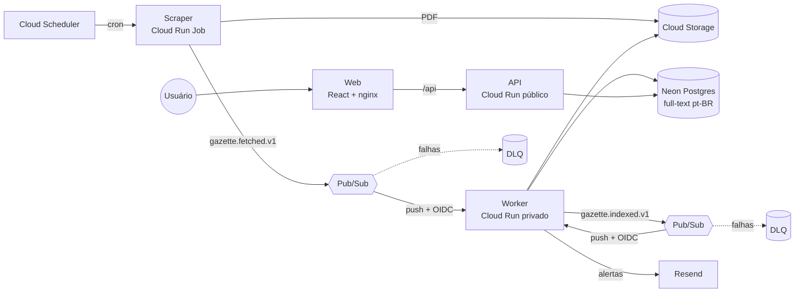

# Diário SG

O Diário Oficial de São Gonçalo sai em PDF, quase todo dia, com dezenas de
páginas de portarias, extratos de contrato, dispensas de licitação e
decretos. Tudo público. Tudo lá. E praticamente ninguém lê, porque ler um PDF
inteiro procurando o nome de uma empresa é o tipo de coisa que só se
faz por obrigação ou por castigo.

O Diário SG lê por você. Todo dia ele baixa as edições novas, separa cada ato
(nomeação, contrato, licitação, dispensa, decreto...), joga tudo num Postgres
com busca em português e te manda um e-mail quando aparece o termo que você
pediu. Quer saber quando o CNPJ daquela empresa ganhar mais um contrato? Ou
quando sair a nomeação do primo do vereador? Cadastra o termo e vai viver a
vida.

Não é um serviço da prefeitura, não tem vínculo com ela e não substitui a
edição oficial. É só um cidadão com um parser e alguma teimosia.

## Como funciona

Um job acorda, visita o site da prefeitura como quem não quer nada, baixa os
PDFs e avisa uma fila. Um worker pega o PDF, extrai o texto, fatia em atos e
indexa. Quando termina, avisa outra fila, e o mesmo worker confere quem
estava esperando por aquilo e manda os e-mails. O resto é uma API e uma
página em React para você não precisar usar `curl` para descobrir quem foi
nomeado ontem.



## Estrutura do monorepo

```
.
├── apps/
│   └── web/                  # Frontend React + Vite, servido por nginx
├── services/
│   ├── scraper/              # Go · Cloud Run Job
│   │   ├── cmd/scraper/      #   composition root (injeta dependências)
│   │   └── internal/
│   │       ├── core/         #   ◀ núcleo: não importa nada de fora
│   │       │   ├── domain/   #     entidades e regras puras
│   │       │   ├── ports/    #     interfaces que o núcleo precisa
│   │       │   └── usecase/  #     casos de uso
│   │       ├── adapters/     #   ◀ camada externa: site da prefeitura, GCS, Pub/Sub
│   │       ├── presentation/ #   ◀ entrada: CLI (o job)
│   │       └── config/
│   └── api/                  # Go · um código, três binários
│       ├── cmd/{api,worker,migrate}/
│       ├── migrations/       #   SQL versionado (embutido no binário)
│       └── internal/
│           ├── core/{domain,ports,usecase}/
│           ├── adapters/     #   postgres, pdf, parser, pubsub, email
│           ├── presentation/
│           │   ├── http/     #     REST público (DTOs separados do domínio)
│           │   └── events/   #     consumidor push do Pub/Sub
│           └── integration/  #   testes com Postgres real
├── pkg/                      # Go compartilhado: clientes GCP, contratos, logs
├── contracts/events/         # JSON Schema dos eventos (fonte da verdade)
├── infra/
│   ├── bootstrap/            # state remoto + Workload Identity (aplicado 1x)
│   ├── modules/              # blocos reutilizáveis (cloud-run-service, pubsub-push)
│   ├── stack/                # a stack completa de um ambiente
│   └── envs/{dev,prod}/      # instâncias da stack
├── .github/workflows/        # ci.yml · infra.yml · deploy.yml
├── docs/adr/                 # decisões de arquitetura
├── docker-compose.yml        # Postgres + emuladores de Pub/Sub e GCS
└── Makefile
```

A regra de dependência é uma só: **setas apontam para dentro**.
`presentation` e `adapters` conhecem o `core`; o `core` só conhece suas
próprias `ports`. Trocar Postgres, provedor de e-mail ou a fonte dos dados é
escrever um novo adapter, sem tocar em caso de uso.

**Novo serviço em outra linguagem?** Crie `services/<nome>/` com a mesma
divisão (`core/domain`, `core/ports`, `core/usecase`, `adapters`,
`presentation`), consuma os eventos descritos em `contracts/events/` e
adicione um job na matriz do CI e do deploy. Em Python, por exemplo:
`src/<pacote>/{core,adapters,presentation}`; em .NET, um projeto por
camada (`Domain`, `Application`, `Infrastructure`, `Api`).

## Rodando localmente

Requisitos: Go 1.22+, Node 20+, Docker e `pdftotext` (pacote `poppler-utils`).

```bash
cp .env.example .env
make up        # Postgres + emuladores
make setup     # bucket, tópicos e assinaturas push
make migrate
make run-api       # terminal 1 · http://localhost:8080
make run-worker    # terminal 2 · recebe mensagens do emulador
make run-web       # terminal 3 · http://localhost:5173
make run-scraper   # dispara uma coleta (janela: LOOKBACK_DAYS do .env)
make run-scraper LOOKBACK_DAYS=7   # outra janela: passe como variável do make,
                                   # não do shell (o .env incluído tem precedência)
make reindex FROM=2020-01-01 TO=2026-12-31   # reprocessa edições já indexadas com o parser atual (não dispara alertas)
make dump DUMPS_BUCKET=diario-dumps          # publica o dump da base no emulador (página em /dados)
```

Testes: `make test` (unitários) e `make test-integration` (Postgres real, num banco
`diario_test` criado pelo próprio teste). Para ter dados reais sem o scraper:
`./scripts/fetch-editions.sh` baixa edições e
`make ingest FILE=services/api/testdata/editions/2026_09_18.pdf DATE=2026-09-18 EDITION=1771`
publica uma delas exatamente como o scraper faria.
Com `NOTIFIER=log`, os e-mails aparecem no log do worker/API.

## API

| Método | Rota | Descrição |
| --- | --- | --- |
| GET | `/v1/acts?q=&type=&organ=&from=&to=&min_value=&max_value=&limit=&offset=` | Busca textual; termos encontrados vêm entre `⟦ ⟧` no `snippet`; `organ` é a sigla (`SEMED`); `min_value`/`max_value` em reais com ponto (`1500.50`) filtram atos que citam ao menos um valor na faixa. Operadores: `"frase"`, `OU`/`OR`, `-excluir`. Cada ato traz `page_start`/`page_end` (`null` se ainda não reindexado), `pdf_sha256` e `values_cents` |
| GET | `/v1/acts/export?format=csv\|json&<filtros da busca>` | Até 10.000 atos da busca com texto completo. CSV para Excel pt-BR (`;`, BOM, decimal com vírgula); `X-Total-Count` e `X-Export-Truncated` nos cabeçalhos |
| GET | `/v1/feeds/acts?<filtros da busca>` | RSS 2.0 com os 50 atos mais recentes da busca |
| GET | `/v1/gazettes/{id}` | Edição com todos os atos |
| GET | `/v1/gazettes/{id}/pdf` | Cópia arquivada do PDF (`ETag` = SHA-256; abra com `#page=N`) |
| GET | `/v1/entities/cnpj/{cnpj}` | Atos em que o CNPJ aparece (os 100 mais recentes), soma dos valores e contagem por tipo sobre todos |
| GET | `/v1/stats/acts?q=&type=&organ=&from=&to=&min_value=&max_value=&group=month` | Contagem de atos por mês |
| GET | `/v1/organs` | Órgãos (sigla e nome por extenso, quando conhecido; fonte de cada nome em `docs/orgaos.md`) com a contagem de atos |
| POST | `/v1/subscriptions` | `{"email","query"}` → envia e-mail de confirmação |
| POST | `/v1/subscriptions/confirm` | `{"token"}` |
| POST | `/v1/subscriptions/unsubscribe` | `{"token"}` |

## Dados abertos

Todo domingo um Cloud Run Job publica a base inteira num bucket público
próprio: `gazettes.csv.gz`, `acts.csv.gz` (com o texto completo),
`act_entities.csv.gz`, `LEIAME.txt` (colunas e como abrir) e
`manifest.json` (linhas, bytes e SHA-256 de cada arquivo). O site serve
tudo em `/dados/`, e a página `/dados` explica os arquivos. Inscrições
em alertas nunca entram no dump.

## Deploy na nuvem (primeira vez)

1. Crie um projeto no Google Cloud com faturamento ativo (o free tier exige
   cartão) e configure um **alerta de orçamento** no console.
2. Crie uma conta no [Neon](https://neon.tech) e gere uma API key. Opcional:
   conta no [Resend](https://resend.com) para e-mails reais.
3. Aplique o bootstrap com seu usuário:
   ```bash
   cd infra/bootstrap
   terraform init
   terraform apply -var project_id=SEU_PROJETO -var github_repository=usuario/diario-sg
   ```
4. No GitHub, crie os Environments `dev` e `prod` (em `prod`, exija revisão).
   Em cada um, cadastre:
   - **Variables**: `GCP_PROJECT_ID`, `GCP_REGION` (`us-central1`),
     `TF_STATE_BUCKET`, `WIF_PROVIDER`, `TERRAFORM_SA`, `DEPLOYER_SA`
     (os quatro últimos são outputs do bootstrap), `EMAIL_FROM`, `PUBLIC_WEB_URL` (opcional)
   - **Secrets**: `NEON_API_KEY`, `RESEND_API_KEY` (opcional)
5. Faça push na `main`: o workflow **Infra** cria a stack de dev e o
   **Deploy** publica as imagens, roda as migrations e atualiza os serviços.
6. Para produção, publique uma release (tag `v*`), ou rode os workflows
   manualmente escolhendo `prod`.
7. Mudou o parser? Rode o workflow **Reindex** (ambiente, `from` e `to`):
   ele executa o Cloud Run Job `diario-<ambiente>-reindex`, que relê os
   PDFs do bucket e troca os atos das edições do período, sem disparar
   alertas. Uma reindexação completa leva horas; se passar do limite de
   6 h, rode por períodos menores.

O ideal é um projeto GCP por ambiente (isolamento de IAM e de custo). Se
quiser economizar no começo, use só `prod`.

## Custos

Tudo foi dimensionado para caber nos planos gratuitos no volume de um
município: Cloud Run (serviços e job escalam a zero), Pub/Sub, Cloud
Scheduler (3 jobs gratuitos), Cloud Storage na região `us-central1`,
Artifact Registry (com limpeza automática de imagens antigas), Secret Manager,
Neon e Resend. Os limites de cada plano mudam com o tempo, então confira as
páginas de preço antes de subir e mantenha o alerta de orçamento ligado.

## Caminho de crescimento

| Quando | O quê |
| --- | --- |
| Banco passa do plano gratuito ou precisa de rede privada | Cloud SQL ou AlloyDB (ADR 0002) |
| Milhares de inscrições | Busca reversa / percolator em vez de 1 busca por inscrição (ADR 0003) |
| Busca mais sofisticada (sinônimos, facetas) | Meilisearch/OpenSearch como adapter extra de `ActRepository` |
| PDFs escaneados | Adapter de OCR (Document AI ou Tesseract) atrás de `TextExtractor` |
| Mais municípios/fontes | Novo adapter de `EditionSource` ou um serviço scraper por fonte |
| Muitos serviços | GKE Autopilot; os containers e contratos de eventos já estão prontos |

## Dados e responsabilidade

Os dados são públicos, mas contêm nomes de pessoas. Mostre só o que foi
publicado, cite sempre a edição original, ofereça canal de correção e não
crie perfis de pessoas físicas a partir dos atos (LGPD). O scraper se
identifica no User-Agent e espera entre downloads.

## Licença e termos

O código está sob a [licença MIT](LICENSE): use, copie, mude e publique, só
mantenha o aviso de copyright. Os atos em si são documentos oficiais e não
têm direito autoral (Lei 9.610/1998, art. 8º, IV), mas continuam citando
pessoas de verdade, então a LGPD vale para quem reutiliza.

Quem usa a instância publicada por este repositório concorda com os
[Termos de uso](TERMOS-DE-USO.md) e pode ler como o e-mail dos alertas é
tratado na [Política de privacidade](PRIVACIDADE.md). Resumo honesto: o texto
extraído pode ter erro, a edição original é que vale, e seu e-mail só serve
para te mandar os alertas que você pediu.

Achou um ato quebrado, um órgão errado ou um bug? Abre uma
[issue](https://github.com/Lucantas/diario-sg/issues). O parser agradece, ele
ainda está aprendendo a ler a prefeitura.
