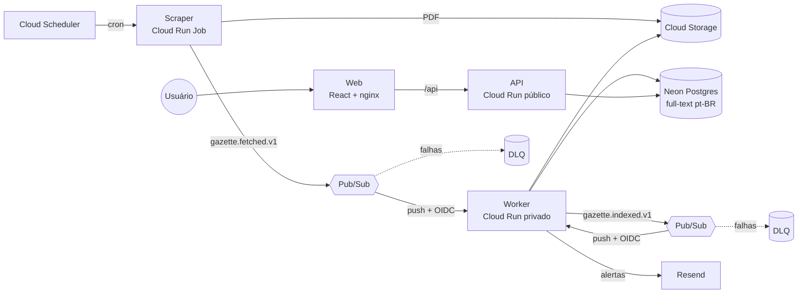

# Diário SG — radar do Diário Oficial de São Gonçalo

Coleta diariamente as edições do Diário Oficial de São Gonçalo (RJ), separa
os atos (nomeações, contratos, licitações, dispensas, decretos...), oferece
busca textual em português por uma API pública e envia alertas por e-mail
quando um termo de interesse aparece.



## Estrutura do monorepo

```
.
├── apps/
│   └── web/                  # Frontend React + Vite, servido por nginx
├── services/
│   ├── scraper/              # Go · Cloud Run Job
│   │   ├── cmd/scraper/      #   composition root (injeta dependências)
│   │   └── internal/
│   │       ├── core/         #   ◀ núcleo: não importa nada de fora
│   │       │   ├── domain/   #     entidades e regras puras
│   │       │   ├── ports/    #     interfaces que o núcleo precisa
│   │       │   └── usecase/  #     casos de uso
│   │       ├── adapters/     #   ◀ camada externa: site da prefeitura, GCS, Pub/Sub
│   │       ├── presentation/ #   ◀ entrada: CLI (o job)
│   │       └── config/
│   └── api/                  # Go · um código, três binários
│       ├── cmd/{api,worker,migrate}/
│       ├── migrations/       #   SQL versionado (embutido no binário)
│       └── internal/
│           ├── core/{domain,ports,usecase}/
│           ├── adapters/     #   postgres, pdf, parser, pubsub, email
│           ├── presentation/
│           │   ├── http/     #     REST público (DTOs separados do domínio)
│           │   └── events/   #     consumidor push do Pub/Sub
│           └── integration/  #   testes com Postgres real
├── pkg/                      # Go compartilhado: clientes GCP, contratos, logs
├── contracts/events/         # JSON Schema dos eventos (fonte da verdade)
├── infra/
│   ├── bootstrap/            # state remoto + Workload Identity (aplicado 1x)
│   ├── modules/              # blocos reutilizáveis (cloud-run-service, pubsub-push)
│   ├── stack/                # a stack completa de um ambiente
│   └── envs/{dev,prod}/      # instâncias da stack
├── .github/workflows/        # ci.yml · infra.yml · deploy.yml
├── docs/adr/                 # decisões de arquitetura
├── docker-compose.yml        # Postgres + emuladores de Pub/Sub e GCS
└── Makefile
```

A regra de dependência é uma só: **setas apontam para dentro**.
`presentation` e `adapters` conhecem o `core`; o `core` só conhece suas
próprias `ports`. Trocar Postgres, provedor de e-mail ou a fonte dos dados é
escrever um novo adapter, sem tocar em caso de uso.

**Novo serviço em outra linguagem?** Crie `services/<nome>/` com a mesma
divisão (`core/domain`, `core/ports`, `core/usecase`, `adapters`,
`presentation`), consuma os eventos descritos em `contracts/events/` e
adicione um job na matriz do CI e do deploy. Em Python, por exemplo:
`src/<pacote>/{core,adapters,presentation}`; em .NET, um projeto por
camada (`Domain`, `Application`, `Infrastructure`, `Api`).

## Rodando localmente

Requisitos: Go 1.22+, Node 20+, Docker e `pdftotext` (pacote `poppler-utils`).

```bash
cp .env.example .env
make up        # Postgres + emuladores
make setup     # bucket, tópicos e assinaturas push
make migrate
make run-api       # terminal 1 · http://localhost:8080
make run-worker    # terminal 2 · recebe mensagens do emulador
make run-web       # terminal 3 · http://localhost:5173
make run-scraper   # dispara uma coleta
```

Testes: `make test` (unitários) e `make test-integration` (Postgres real, num banco
`diario_test` criado pelo próprio teste). Para ter dados reais sem o scraper:
`./scripts/fetch-editions.sh` baixa edições e
`make ingest FILE=services/api/testdata/editions/2026_09_18.pdf DATE=2026-09-18 EDITION=1771`
publica uma delas exatamente como o scraper faria.
Com `NOTIFIER=log`, os e-mails aparecem no log do worker/API.

## API

| Método | Rota | Descrição |
| --- | --- | --- |
| GET | `/v1/acts?q=&type=&from=&to=&limit=&offset=` | Busca textual; termos encontrados vêm entre `⟦ ⟧` no `snippet` |
| GET | `/v1/gazettes/{id}` | Edição com todos os atos |
| GET | `/v1/entities/cnpj/{cnpj}` | Atos em que o CNPJ aparece (mais recentes primeiro), soma dos valores e contagem por tipo |
| GET | `/v1/stats/acts?type=&from=&to=&group=month` | Contagem de atos por mês |
| POST | `/v1/subscriptions` | `{"email","query"}` → envia e-mail de confirmação |
| POST | `/v1/subscriptions/confirm` | `{"token"}` |
| POST | `/v1/subscriptions/unsubscribe` | `{"token"}` |

## Deploy na nuvem (primeira vez)

1. Crie um projeto no Google Cloud com faturamento ativo (o free tier exige
   cartão) e configure um **alerta de orçamento** no console.
2. Crie uma conta no [Neon](https://neon.tech) e gere uma API key. Opcional:
   conta no [Resend](https://resend.com) para e-mails reais.
3. Aplique o bootstrap com seu usuário:
   ```bash
   cd infra/bootstrap
   terraform init
   terraform apply -var project_id=SEU_PROJETO -var github_repository=usuario/diario-sg
   ```
4. No GitHub, crie os Environments `dev` e `prod` (em `prod`, exija revisão).
   Em cada um, cadastre:
   - **Variables**: `GCP_PROJECT_ID`, `GCP_REGION` (`us-central1`),
     `TF_STATE_BUCKET`, `WIF_PROVIDER`, `TERRAFORM_SA`, `DEPLOYER_SA`
     (os quatro últimos são outputs do bootstrap), `EMAIL_FROM`, `PUBLIC_WEB_URL` (opcional)
   - **Secrets**: `NEON_API_KEY`, `RESEND_API_KEY` (opcional)
5. Faça push na `main`: o workflow **Infra** cria a stack de dev e o
   **Deploy** publica as imagens, roda as migrations e atualiza os serviços.
6. Para produção, publique uma release (tag `v*`) — ou rode os workflows
   manualmente escolhendo `prod`.

O ideal é um projeto GCP por ambiente (isolamento de IAM e de custo). Se
quiser economizar no começo, use só `prod`.

## Custos

Tudo foi dimensionado para caber nos planos gratuitos no volume de um
município: Cloud Run (serviços e job escalam a zero), Pub/Sub, Cloud
Scheduler (3 jobs gratuitos), Cloud Storage na região `us-central1`,
Artifact Registry (com limpeza automática de imagens antigas), Secret Manager,
Neon e Resend. Os limites de cada plano mudam com o tempo — confira as
páginas de preço antes de subir e mantenha o alerta de orçamento ligado.

## Caminho de crescimento

| Quando | O quê |
| --- | --- |
| Banco passa do plano gratuito ou precisa de rede privada | Cloud SQL ou AlloyDB (ADR 0002) |
| Milhares de inscrições | Busca reversa / percolator em vez de 1 busca por inscrição (ADR 0003) |
| Busca mais sofisticada (sinônimos, facetas) | Meilisearch/OpenSearch como adapter extra de `ActRepository` |
| PDFs escaneados | Adapter de OCR (Document AI ou Tesseract) atrás de `TextExtractor` |
| Mais municípios/fontes | Novo adapter de `EditionSource` ou um serviço scraper por fonte |
| Muitos serviços | GKE Autopilot; os containers e contratos de eventos já estão prontos |

## Dados e responsabilidade

Os dados são públicos, mas contêm nomes de pessoas. Mostre só o que foi
publicado, cite sempre a edição original, ofereça canal de correção e não
crie perfis de pessoas físicas a partir dos atos (LGPD). O scraper se
identifica no User-Agent e espera entre downloads.
