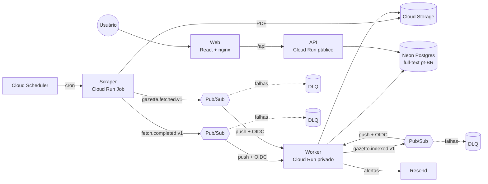

# Diário SG

O Diário Oficial de São Gonçalo sai em PDF, quase todo dia, com dezenas de
páginas de portarias, extratos de contrato, dispensas de licitação e
decretos. Tudo público. Tudo lá. E praticamente ninguém lê, porque ler um PDF
inteiro procurando o nome de uma empresa é o tipo de coisa que só se
faz por obrigação ou por castigo.

O Diário SG lê por você. Todo dia ele baixa as edições novas do Diário da
Prefeitura e do Diário Oficial Eletrônico da Câmara Municipal, separa cada ato
(nomeação, contrato, licitação, dispensa, decreto...), joga tudo num Postgres
com busca em português e te manda um e-mail quando aparece o termo que você
pediu. Quer saber quando o CNPJ daquela empresa ganhar mais um contrato? Ou
quando sair a nomeação do primo do vereador? Cadastra o termo e vai viver a
vida.

Não é um serviço da prefeitura nem da Câmara, não tem vínculo com elas e não
substitui a edição oficial. É só um cidadão com um parser e alguma teimosia.

## Como funciona

Um job por diário acorda, visita o site da prefeitura (ou o da Câmara) como
quem não quer nada, baixa os PDFs e avisa uma fila. Um worker pega o PDF, extrai o texto, fatia em atos e
indexa. Quando termina, avisa outra fila, e o mesmo worker confere quem
estava esperando por aquilo e manda os e-mails. O resto é uma API e uma
página em React para você não precisar usar `curl` para descobrir quem foi
nomeado ontem.


```mermaid
flowchart LR
  sched[Cloud Scheduler] -->|cron| scraper[Scraper<br/>Cloud Run Job]
  scraper -->|PDF| gcs[(Cloud Storage)]
  scraper -->|gazette.fetched.v1| q1{{Pub/Sub}}
  scraper -->|fetch.completed.v1| q3{{Pub/Sub}}
  q3 -->|push + OIDC| worker
  q1 -->|push + OIDC| worker[Worker<br/>Cloud Run privado]
  worker --> gcs
  worker --> db[(Neon Postgres<br/>full-text pt-BR)]
  worker -->|gazette.indexed.v1| q2{{Pub/Sub}}
  q2 -->|push + OIDC| worker
  worker -->|alertas| mail[Resend]
  user((Usuário)) --> web[Web<br/>React + nginx]
  web -->|/api| api[API<br/>Cloud Run público]
  api --> db
  q1 -.falhas.-> dlq1[(DLQ)]
  q2 -.falhas.-> dlq2[(DLQ)]
  q3 -.falhas.-> dlq3[(DLQ)]
```

## Estrutura do monorepo

```
.
├── apps/
│   └── web/                  # Frontend React + Vite, servido por nginx
├── services/
│   ├── scraper/              # Go · Cloud Run Job
│   │   ├── cmd/scraper/      #   composition root (injeta dependências)
│   │   └── internal/
│   │       ├── core/         #   ◀ núcleo: não importa nada de fora
│   │       │   ├── domain/   #     entidades e regras puras
│   │       │   ├── ports/    #     interfaces que o núcleo precisa
│   │       │   └── usecase/  #     casos de uso
│   │       ├── adapters/     #   ◀ camada externa: site da prefeitura, GCS, Pub/Sub
│   │       ├── presentation/ #   ◀ entrada: CLI (o job)
│   │       └── config/
│   └── api/                  # Go · um código, três binários
│       ├── cmd/{api,worker,migrate}/
│       ├── migrations/       #   SQL versionado (embutido no binário)
│       └── internal/
│           ├── core/{domain,ports,usecase}/
│           ├── adapters/     #   postgres, pdf, parser, pubsub, email
│           ├── presentation/
│           │   ├── http/     #     REST público (DTOs separados do domínio)
│           │   └── events/   #     consumidor push do Pub/Sub
│           └── integration/  #   testes com Postgres real
├── pkg/                      # Go compartilhado: clientes GCP, contratos, logs
├── contracts/events/         # JSON Schema dos eventos (fonte da verdade)
├── infra/
│   ├── bootstrap/            # state remoto + Workload Identity (aplicado 1x)
│   ├── modules/              # blocos reutilizáveis (cloud-run-service, pubsub-push)
│   ├── stack/                # a stack completa de um ambiente
│   └── envs/{dev,prod}/      # instâncias da stack
├── .github/workflows/        # ci.yml · infra.yml · deploy.yml
├── docs/adr/                 # decisões de arquitetura
├── docker-compose.yml        # Postgres + emuladores de Pub/Sub e GCS
└── Makefile
```

A regra de dependência é uma só: **setas apontam para dentro**.
`presentation` e `adapters` conhecem o `core`; o `core` só conhece suas
próprias `ports`. Trocar Postgres, provedor de e-mail ou a fonte dos dados é
escrever um novo adapter, sem tocar em caso de uso.

**Novo serviço em outra linguagem?** Crie `services/<nome>/` com a mesma
divisão (`core/domain`, `core/ports`, `core/usecase`, `adapters`,
`presentation`), consuma os eventos descritos em `contracts/events/` e
adicione um job na matriz do CI e do deploy. Em Python, por exemplo:
`src/<pacote>/{core,adapters,presentation}`; em .NET, um projeto por
camada (`Domain`, `Application`, `Infrastructure`, `Api`).

## Rodando localmente

Requisitos: Go 1.25+, Node 22.12+, Docker, `pdftotext` (pacote
`poppler-utils`) e o Tesseract com o português (`tesseract` e
`tesseract-data-por`, ou `tesseract-ocr-por` no Debian), que lê as páginas
escaneadas. Sem o pacote do português no sistema, baixe o `por.traineddata`
e o `osd.traineddata` numa pasta e aponte `TESSDATA_PREFIX` para ela no
`.env`; os testes de OCR pulam quando o português não está instalado.

```bash
cp .env.example .env
make up        # Postgres + emuladores
make setup     # bucket, tópicos e assinaturas push
make migrate
make run-api       # terminal 1 · http://localhost:8080
make run-worker    # terminal 2 · recebe mensagens do emulador
make run-web       # terminal 3 · http://localhost:5173
make run-scraper   # dispara uma coleta (janela: LOOKBACK_DAYS do .env)
make run-scraper LOOKBACK_DAYS=7   # outra janela: passe como variável do make,
                                   # não do shell (o .env incluído tem precedência)
make run-scraper-camara FROM=2020-10-04   # Diário da Câmara (a URL por data só existe desde 2020-10-04;
                                          # é um pedido por dia, com 2 s entre eles)
make reindex FROM=2020-01-01 TO=2026-12-31   # reprocessa edições já indexadas com o parser atual (não dispara alertas)
make dump DUMPS_BUCKET=diario-dumps          # publica o dump da base no emulador (página em /dados)
make reports                                 # reportes de erro abertos (STATUS=resolvido|descartado para os fechados)
make close-report ID=<id> AS=resolvido       # fecha um reporte (ou AS=descartado)
make keys                                    # chaves do MCP com o uso dos últimos 30 dias
make revoke-key PREFIX=<prefixo>             # revoga uma chave pelo prefixo que aparece no log
```

Testes: `make test` (unitários) e `make test-integration` (Postgres real, num banco
`diario_test` criado pelo próprio teste). Para ter dados reais sem o scraper:
`./scripts/fetch-editions.sh` baixa edições e
`make ingest FILE=services/api/testdata/editions/2026_09_18.pdf DATE=2026-09-18 EDITION=1771`
publica uma delas exatamente como o scraper faria.
Com `NOTIFIER=log`, os e-mails aparecem no log do worker/API.

## API

| Método | Rota | Descrição |
| --- | --- | --- |
| GET | `/v1/acts?q=&source=&type=&organ=&modality=&from=&to=&min_value=&max_value=&main_value_min=&main_value_max=&entity=&limit=&offset=` | Busca textual nos dois diários; `source` (`diario_prefeitura` ou `diario_camara`) restringe a um deles, e cada ato traz `source` e `source_name`; termos encontrados vêm entre `⟦ ⟧` no `snippet`; `organ` é a sigla de um órgão da prefeitura (`SEMED`); `min_value`/`max_value` em reais com ponto (`1500.50`) filtram atos que citam ao menos um valor na faixa; `modality` (`dispensa`, `inexigibilidade`, `pregao`…) e `main_value_min`/`main_value_max` filtram pela modalidade e pelo valor principal lidos do texto (`modality` e `main_value_cents` em cada ato); `entity=<tipo>:<número>` (`cnpj`, `processo` ou `contrato`, com `-` no lugar de `/` se preferir) traz só os atos ligados ao número, como nas páginas de entidade, e número inválido é 400. Operadores: `"frase"`, `OU`/`OR`, `-excluir`. Cada ato traz `position` (ordem na edição), `page_start`/`page_end` (`null` se ainda não reindexado), `pdf_sha256`, `values_cents`, `warnings` (avisos de extração: `sem_numero`, `so_titulo`, `muitas_paginas`, `varios_atos_possiveis`, `lido_por_ocr`) e `mentions` (processos e contratos citados no ato, cada um com `kind`, `key`, `label` e `slug` para a URL das páginas de processo/contrato); `phase` só aparece no relatório de `/v1/entities/processo` e `/v1/entities/contrato` |
| GET | `/v1/acts/export?format=csv\|json&<filtros da busca>` | Até 10.000 atos da busca com texto completo e a coluna `fonte`. CSV para Excel pt-BR (`;`, BOM, decimal com vírgula); `X-Total-Count` e `X-Export-Truncated` nos cabeçalhos |
| GET | `/v1/feeds/acts?<filtros da busca>` | RSS 2.0 com os 50 atos mais recentes da busca; com `entity`, o link do canal é a página da entidade |
| GET | `/v1/gazettes/{id}` | Edição com todos os atos |
| GET | `/v1/gazettes/{id}/pdf` | Cópia arquivada do PDF (`ETag` = SHA-256; abra com `#page=N`) |
| GET | `/v1/entities/cnpj/{cnpj}` | Atos em que o CNPJ aparece (os 100 mais recentes), soma dos valores e contagem por tipo sobre todos; `registry` (Receita), `sanctions` (CGU), `payments` (TCE-RJ) e `pncp_contracts` (contratos no PNCP, com `url`) |
| GET | `/v1/entities/processo/{n}` e `/v1/entities/contrato/{n}` | Atos ligados ao número (os 300 mais recentes), do mais recente ao mais antigo e, na mesma edição, na ordem da página; `n` aceita `-` no lugar de `/` (`30-FMS-2011`). Resposta com `label` (grafia mais frequente no Diário), `count_by_phase` (fase de cada ato, calculada na leitura), `organs` (contagem por órgão, com as variantes de sigla somadas na principal e `""` para os atos sem órgão) e `related` (citados junto, até 20 de cada tipo, pelos que têm mais atos: processo lista contratos e CNPJs, contrato lista processos e CNPJs); tipo desconhecido é 404, número inválido é 400 |
| GET | `/v1/stats/acts?q=&type=&organ=&from=&to=&min_value=&max_value=&group=month` | Contagem de atos por mês |
| GET | `/v1/patterns` | Padrões para verificar (os 13 de `/padroes`: os do Diário, como fracionamento de dispensa e aditivo acima do limite; os do fornecedor, com o cadastro da Receita e as sanções da CGU; os de anunciado × pago, com os empenhos do TCE-RJ; e o de contrato no PNCP sem extrato), calculados na leitura: cada padrão com `id`, `title`, `rule` (a regra por extenso), `caveat` e `findings` (`title`, `detail`, `acts` no formato da busca, `search`, com `type`, `from`, `to` e `source` quando os atos são muitos para listar, e `link`, com `label` e `url`, quando o caso aponta para fora, como um contrato no PNCP) |
| GET | `/v1/panels/suppliers` | Maiores fornecedores pelo valor declarado nos extratos, calculados na leitura. `year`, `organ` e `source` (padrão `diario_prefeitura`) filtram. Cada contratação (atos do mesmo CNPJ ligados pelo processo ou pelo contrato) conta uma vez, pelo maior valor de contrato; ata de registro de preços sem contrato vai para `registered_cents`; aditivos, homologações, multas, sanções, notificações, cancelamentos e atos com mais de um fornecedor ficam de fora. Traz `items` (50 primeiros, com `largest`, o ato de maior valor no formato da busca), `years` (respeita `organ`) e `organs` (respeita `year`) |
| GET | `/v1/panels/staff?unit=` | Vínculos e remuneração por mês e grupo de situação funcional, informados pelo município ao TCE-RJ (de 2024 em diante), com as nomeações e exonerações do Diário no mês (`diario_source` diz qual). Traz `units`, `groups` (na ordem das colunas) e `months` (do mais recente ao mais antigo); unidade desconhecida é 400 |
| GET | `/v1/tce` | Controle do TCE-RJ sobre São Gonçalo: `accounts` (parecer prévio por exercício), `penalties` (débitos e multas agrupados por processo do TCE, com `search`, a busca do número no Diário) e `works` (obras paralisadas); `/v1/entities/cnpj/{cnpj}` traz as obras da empresa em `stalled_works` |
| GET | `/v1/agentes?role=&q=` | Agentes políticos: `agents` (órgão, cargo, nome, lotações, partido e nome parlamentar do vereador, primeiro e último mês e `months` com bruto, descontos e líquido), `norms` (subsídio fixado, com a busca da norma no Diário) e `coverage` (meses carregados de cada folha); `role` (`prefeito`, `vice_prefeito`, `secretario`, `procurador_geral`, `vereador`) e `q` (parte do nome, do nome parlamentar ou da lotação) filtram |
| GET | `/v1/federal` | Dinheiro federal: `transfers` (soma por ano, tipo e função, com `transfers_coverage`, os meses carregados), `amendments` (emendas com aplicação em São Gonçalo) e `favored` (pessoas jurídicas de São Gonçalo que receberam pagamento de emenda, somadas por CNPJ); `/v1/entities/cnpj/{cnpj}` traz os pagamentos à empresa em `amendment_payments` |
| GET | `/v1/organs` | Órgãos (sigla e nome por extenso, quando conhecido; fonte de cada nome em `docs/orgaos.md`) com a contagem de atos |
| POST | `/v1/reports` | `{"gazette_id","position","act_title","kind","message"}` → reporte de erro de extração na fila (`kind`: `texto_errado`, `tipo_errado`, `orgao_errado`, `pagina_errada`, `outro`); 5 por minuto por cliente |
| POST | `/v1/mcp/keys` | Gera uma chave do servidor MCP (`{"key","prefix","mcp_url"}`); a chave só aparece nesta resposta; 3 por hora por cliente |
| DELETE | `/v1/mcp/keys` | Revoga a chave enviada em `Authorization: Bearer` |
| POST | `/mcp` | Servidor MCP (HTTP "streamable", sem sessão); ver abaixo |
| GET | `/.well-known/oauth-protected-resource`, `/.well-known/oauth-authorization-server` | Metadados OAuth do servidor MCP (RFC 9728 e RFC 8414); o site passa `/.well-known/` para a API |
| POST | `/oauth/register` | Registro dinâmico de cliente (RFC 7591): `{"redirect_uris","client_name"}` → `client_id`; só cliente público; 100 por hora por cliente; cliente que nunca trocou código some em 7 dias |
| GET, POST | `/oauth/authorize` | Página de consentimento (código com PKCE `S256`); "Autorizar" volta ao `redirect_uri` com `code`, `state` e `iss`, 10 por hora por cliente; pedido malformado fica na página, sem redirecionar |
| POST | `/oauth/token` | Troca o código por uma chave MCP (`access_token`), sem expiração nem refresh token; 60 por minuto por cliente |
| POST | `/v1/subscriptions` | `{"email","query"}` (termo) ou `{"email","entity":{"kind","value"}}` (CNPJ, processo ou contrato; o alerta sai pelas ligações da edição, não pelo texto) → envia e-mail de confirmação; a resposta traz `subject` e `entity` |
| POST | `/v1/subscriptions/confirm` | `{"token"}` |
| POST | `/v1/subscriptions/unsubscribe` | `{"token"}` |

## Servidor MCP

Para perguntar ao Diário pela IA que você já usa. No claude.ai, no
ChatGPT e em outros clientes com OAuth, adicione um conector com o
endereço `https://<site>/api/mcp`: abre uma página do Diário SG, a pessoa
clica em "Autorizar" e o cliente recebe uma chave. No Claude Code:

```bash
claude mcp add --transport http diario-sg https://<site>/api/mcp   # depois /mcp para autorizar
```

Sem OAuth, gere uma chave em `/mcp` no site e mande no cabeçalho:

```bash
claude mcp add --transport http diario-sg https://<site>/api/mcp \
  --header "Authorization: Bearer dsg_…"
```

Não há conta de usuário: o token do OAuth é uma chave como a de `/mcp`,
anônima, com o mesmo limite, a mesma contagem de uso e a mesma revogação
(`make revoke-key`). O fluxo segue a especificação de autorização do MCP:
o 401 do `/mcp` aponta os metadados do recurso, o cliente se registra
sozinho e troca o código com PKCE. Desenho em
`docs/superpowers/specs/2026-09-27-oauth-do-mcp-design.md`.

Ferramentas, todas só de leitura: `buscar_atos` (a busca do site,
paginada, até 20 atos; `diario` escolhe Prefeitura ou Câmara), `ler_ato`
(texto completo e citação pronta),
`entidade` (atos que citam um CNPJ, um processo ou um contrato, com a
certeza da ligação; processo ou contrato que aparece nos dois diários tem
certeza fraca, e `diario` restringe a um deles; `orgao_publico` marca o
CNPJ do Município, de fundações, fundos, SG-PREVI e Câmara; vem também
`rotulo` (o número como o Diário escreve), `atos_por_fase`, `orgaos`
(contagem por órgão) e, em cada item de `atos_recentes`, `fase`, para os
três tipos, CNPJ inclusive; processo e contrato trazem ainda
`citados_junto` (até 20 de cada tipo, pelos que têm mais atos: processo
lista contratos e CNPJs, contrato lista processos e CNPJs)), `agrupar`
(conta os atos por CNPJ, processo, órgão ou tipo com os filtros da busca,
e por padrão deixa os CNPJs de órgãos públicos de fora), `pagina_original`
(texto cru de uma página do PDF arquivado, com o SHA-256, para conferir o
que o parser leu), `fontes`
(período coberto, última coleta e lacunas de cada diário) e
`agentes_politicos` (prefeito, vice, secretários, Procurador-Geral e
vereadores com a remuneração mês a mês e o subsídio fixado em lei) e
`padroes` (os padrões para verificar de `/padroes`: sem argumentos, o
catálogo com o número de achados; com `padrao`, os achados daquele
padrão; com `cnpj`, `processo` ou `contrato`, só os achados que citam a
entidade, com a mesma chave de `entidade`; cada achado traz as entidades e
os atos que o acionaram). Dois prompts prontos encadeiam as ferramentas:
`investigar_fornecedor` (CNPJ) e `seguir_contrato` (processo ou
contrato). `buscar_atos` e
`agrupar` aceitam `modalidade`, `valor_principal_min`/`valor_principal_max`
e `nome` (pessoa ou empresa com as palavras juntas, sem as listas longas de
nomes, a menos que venha `incluir_listas`);
`ler_ato` traz `partes` (cada CNPJ com o nome provável ao lado) e, nos termos
de CEAPM da Câmara, `cota_parlamentar` (vereador, mês e valor). A cobertura vem
na primeira página da busca, e `alertas_coleta` aparece em toda resposta
quando a última coleta de um diário falhou. Todo ato vem com o diário, a edição, o link oficial na página do ato, a
cópia arquivada e o SHA-256 do PDF. Limite de 60 chamadas por minuto por
chave. Localmente: `make run-api` e `http://localhost:8080/mcp`, ou
`make run-web` e `http://localhost:5173/api/mcp` para testar o OAuth.

## Diário da Câmara

O Diário Oficial Eletrônico da Câmara Municipal fica nas mesmas tabelas do
da Prefeitura, com `gazettes.source = 'diario_camara'` (ADR 0007). O job
`scraper-camara` roda o mesmo scraper com `SOURCE=diario_camara`: ele
pergunta, dia a dia, se existe
`https://www.cmsg.rj.gov.br/diariooficialeletronico/PUBLICACOES/AAAA-MM-DD.pdf`
e guarda o PDF em `raw/diario_camara/AAAA/MM/DD/`. O evento
`gazette.fetched.v1` leva a fonte, e o worker usa o parser com o cabeçalho
da Câmara. Edições anteriores a 2020-10-04 não estão disponíveis por data
e ficam de fora; os atos da Câmara não têm órgão.

## Cadastro da Receita

Todo dia 20, o job `receita` lê os dados abertos do CNPJ da Receita
Federal (compartilhamento público do Nextcloud da Receita, por WebDAV) e
guarda empresa, estabelecimento e sócios só dos CNPJs citados nos Diários
(`rf_companies`, `rf_establishments`, `rf_partners`, ADR 0008). Os zips
são lidos por `Range`, sem ir para o disco; a carga leva cerca de uma
hora e troca o mês anterior numa transação. As linhas filtradas ficam em
`raw/receita_cnpj/AAAA/MM/01/`, com um `manifest.json` de SHA-256. A
página da empresa, a ferramenta `entidade` do MCP e os painéis mostram o
cadastro; sócios só aparecem dentro da empresa (ADR 0006) e não entram no
dump.

```bash
make receita                 # mês mais recente publicado pela Receita
make receita MONTH=2026-09   # um mês específico
```

## Sanções da CGU

Todo dia às 07:00, o job `sancoes` baixa do Portal da Transparência o
arquivo mais recente do CEIS, do CNEP e do CEPIM e guarda as sanções de
pessoa jurídica aplicadas às empresas dos CNPJs citados (pelo CNPJ básico)
em `cgu_sanctions`. Linhas de pessoa física são descartadas na leitura. O
CEPIM (entidades sem fins lucrativos impedidas de receber transferência da
União por convênio) tem outras colunas e nenhuma data: cada par CNPJ e
convênio vira um impedimento, que fica fora do padrão "sancionado
contratado", porque não impede contratar com o Município. Se um cadastro
falha (o CEPIM já respondeu 403 por dias), os outros são gravados e a
coleta registra o erro do que faltou. A
carga faz *upsert*: a sanção que sai do cadastro fica, com o último dia em
que foi vista. As linhas filtradas ficam em
`raw/cgu_sancoes/AAAA/MM/DD/`, com o SHA-256 do zip. A página da empresa e
a ferramenta `entidade` do MCP mostram as sanções e o estado de cada uma
(no cadastro, prazo encerrado, fora do cadastro).

```bash
make sancoes
```

## Pagamentos do TCE-RJ

Todo domingo, o job `tce` baixa da API de dados abertos do TCE-RJ os
empenhos de São Gonçalo do ano anterior e do corrente (empenhado,
liquidado e pago por credor e mês) e troca cada ano em `payments`. Só
entram credores pessoa jurídica. A cobertura começa em 2020, e 2020 só
traz o empenhado. A página da empresa mostra o pago por ano, e os painéis
mostram o pago ao lado do contratado.

```bash
make tce                     # ano anterior e corrente
make tce FROM=2020 TO=2026   # carga completa
```

O mesmo job carrega, depois dos empenhos, os agregados de pessoal que o
município informa ao TCE-RJ (`situacao_funcional`: vínculos e remuneração
por mês, unidade e situação funcional, de 2024 em diante) em `tce_staff`,
sem nenhum dado de pessoa. A página `/pessoal` mostra os vínculos mês a
mês por grupo, ao lado das nomeações e exonerações publicadas no Diário.
Por fim, o job carrega o que o TCE-RJ publica sobre o controle do
município (parecer prévio das contas de governo, débitos e multas e obras
paralisadas) em `tce_accounts`, `tce_penalties` e `tce_stalled_works`,
mostrados em `/tce`.

## Dinheiro federal

Todo domingo às 08:00, o job `federal` baixa do Portal da Transparência o
arquivo de emendas parlamentares e as transferências da União dos três
últimos meses publicados, e guarda o que é de São Gonçalo: as emendas com
aplicação no município (`federal_amendments`), os pagamentos de emenda a
pessoas jurídicas da cidade (`federal_amendment_payments`, ligados às
empresas pelo CNPJ) e as transferências (`federal_transfers`). CPF não
entra. O Portal pede verificação humana quando recebe muitos downloads
seguidos, então o job espera 20 segundos entre um e outro. A página
`/federal` mostra os três conjuntos.

```bash
make federal                         # emendas e três últimos meses
make federal FROM=202101 TO=202312   # transferências de outra faixa
```

## Agentes políticos

Todo dia 10 às 09:00, o job `agentes` lê a folha dos três últimos meses:
a da Prefeitura pela API do portal de transparência (um mês por pedido,
de 10/2010 em diante, só o bruto) e a da Câmara pela exportação em JSON do
portal da Câmara (um ano por pedido, de 2017 em diante, com vencimentos,
descontos e líquido). Guarda só os agentes políticos em
`political_agent_pay`: da Prefeitura, a função `PREFEITO`,
`VICE-PREFEITO`, `SECRETARIO MUNICIPAL` ou `PROCURADOR GERAL DO
MUNICIPIO`; da Câmara, o regime `Agente Político` com cargo `VEREADOR`.
Toda outra linha é descartada na leitura (ADR 0006). Os vereadores da
legislatura (nome parlamentar, partido, situação) vêm da API de integração
do SICAM que o site da Câmara usa e ficam em `councillors`. O arquivo
bruto guarda só as linhas dos agentes, com o SHA-256 de cada resposta
inteira. Cada folha substitui só os próprios meses: se a da Câmara falha,
a da Prefeitura é gravada assim mesmo, e o erro fica na coleta. A página
`/agentes` mostra o subsídio fixado (Lei nº 1.554/2024 e Resolução
nº 2.156/2024) e cada agente mês a mês. Como o nome é a única chave, a
mesma pessoa com grafias diferentes entre meses (NATAM e NATAN, por
exemplo) aparece como dois agentes.

```bash
make agentes                            # três últimos meses
make agentes FROM=2010-10 TO=2026-09    # histórico
```

## Contratos do PNCP

Todo domingo às 06:00, o job `pncp` pede à API de consulta do Portal
Nacional de Contratações Públicas os contratos da Prefeitura, dos fundos e
fundações e da Câmara, de 2021 ao ano corrente, e troca os anos lidos em
`pncp_contracts`. Contratos com pessoa física são descartados na leitura.
A API limita o ritmo, então a carga pausa entre pedidos e leva alguns
minutos. A página da empresa mostra os contratos com o link para o PNCP, e
o padrão `pncp_sem_extrato` lista os que não aparecem no Diário.

```bash
make pncp                     # 2021 ao ano corrente
make pncp FROM=2025 TO=2026   # só alguns anos
```

## Entidades e coletas

Cada CNPJ, processo e contrato citado num ato vira uma entidade
(`entities`), ligada ao ato em `entity_links` com a certeza da ligação:
`exata` para CNPJ, `forte` para processo e contrato com a sigla do órgão,
`fraca` para contrato só com número e ano, que se repete entre órgãos. As
fontes novas vão se ligar às mesmas entidades (ADR 0004). Cada execução do
scraper publica `fetch.completed.v1`, e o worker grava a coleta em
`fetch_runs` (ADR 0005). As regras de dado pessoal estão na ADR 0006.

## Dados abertos

Todo domingo um Cloud Run Job publica a base inteira num bucket público
próprio: `gazettes.csv.gz`, `acts.csv.gz` (com o texto completo),
`act_entities.csv.gz`, `LEIAME.txt` (colunas e como abrir) e
`manifest.json` (linhas, bytes e SHA-256 de cada arquivo). O site serve
tudo em `/dados/`, e a página `/dados` explica os arquivos. Inscrições
em alertas nunca entram no dump.

## Deploy na nuvem (primeira vez)

1. Crie um projeto no Google Cloud com faturamento ativo (o free tier exige
   cartão) e configure um **alerta de orçamento** no console.
2. Crie uma conta no [Neon](https://neon.tech) e gere uma API key. Opcional:
   conta no [Resend](https://resend.com) para e-mails reais.
3. Aplique o bootstrap com seu usuário:
   ```bash
   cd infra/bootstrap
   terraform init
   terraform apply -var project_id=SEU_PROJETO -var github_repository=usuario/diario-sg
   ```
4. No GitHub, crie os Environments `dev` e `prod` (em `prod`, exija revisão).
   Em cada um, cadastre:
   - **Variables**: `GCP_PROJECT_ID`, `GCP_REGION` (`us-central1`),
     `TF_STATE_BUCKET`, `WIF_PROVIDER`, `TERRAFORM_SA`, `DEPLOYER_SA`
     (os quatro últimos são outputs do bootstrap), `EMAIL_FROM`, `PUBLIC_WEB_URL` (opcional)
   - **Secrets**: `NEON_API_KEY`, `RESEND_API_KEY` (opcional)
5. Faça push na `main`: o workflow **Infra** cria a stack de dev e o
   **Deploy** publica as imagens, roda as migrations e atualiza os serviços.
6. Para produção, publique uma release (tag `v*`), ou rode os workflows
   manualmente escolhendo `prod`.
7. Mudou o parser? Rode o workflow **Reindex** (ambiente, `from` e `to`):
   ele executa o Cloud Run Job `diario-<ambiente>-reindex`, que relê os
   PDFs do bucket e troca os atos das edições do período, sem disparar
   alertas. Uma reindexação completa leva horas; se passar do limite de
   6 h, rode por períodos menores.

O ideal é um projeto GCP por ambiente (isolamento de IAM e de custo). Se
quiser economizar no começo, use só `prod`.

## Custos

Tudo foi dimensionado para caber nos planos gratuitos no volume de um
município: Cloud Run (serviços e job escalam a zero), Pub/Sub, Cloud
Scheduler (3 jobs gratuitos), Cloud Storage na região `us-central1`,
Artifact Registry (com limpeza automática de imagens antigas), Secret Manager,
Neon e Resend. Os limites de cada plano mudam com o tempo, então confira as
páginas de preço antes de subir e mantenha o alerta de orçamento ligado.

## Caminho de crescimento

| Quando | O quê |
| --- | --- |
| Banco passa do plano gratuito ou precisa de rede privada | Cloud SQL ou AlloyDB (ADR 0002) |
| Milhares de inscrições | Busca reversa / percolator em vez de 1 busca por inscrição (ADR 0003) |
| Busca mais sofisticada (sinônimos, facetas) | Meilisearch/OpenSearch como adapter extra de `ActRepository` |
| OCR com muito erro nas tabelas escaneadas | Document AI atrás de `TextExtractor`, no lugar do Tesseract |
| Mais municípios/fontes | Novo adapter de `EditionSource` ou um serviço scraper por fonte |
| Muitos serviços | GKE Autopilot; os containers e contratos de eventos já estão prontos |

## Dados e responsabilidade

Os dados são públicos, mas contêm nomes de pessoas. Mostre só o que foi
publicado, cite sempre a edição original, ofereça canal de correção e não
crie perfis de pessoas físicas a partir dos atos (LGPD). O scraper se
identifica no User-Agent e espera entre downloads.

## Licença e termos

O código está sob a [licença MIT](LICENSE): use, copie, mude e publique, só
mantenha o aviso de copyright. Os atos em si são documentos oficiais e não
têm direito autoral (Lei 9.610/1998, art. 8º, IV), mas continuam citando
pessoas de verdade, então a LGPD vale para quem reutiliza.

Quem usa a instância publicada por este repositório concorda com os
[Termos de uso](TERMOS-DE-USO.md) e pode ler como o e-mail dos alertas é
tratado na [Política de privacidade](PRIVACIDADE.md). Resumo honesto: o texto
extraído pode ter erro, a edição original é que vale, e seu e-mail só serve
para te mandar os alertas que você pediu.

Achou um ato quebrado, um órgão errado ou um bug? Abre uma
[issue](https://github.com/Lucantas/diario-sg/issues). O parser agradece, ele
ainda está aprendendo a ler a prefeitura.
